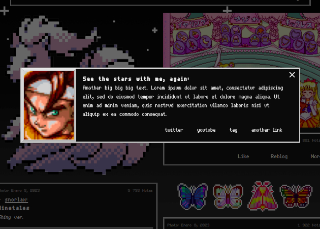
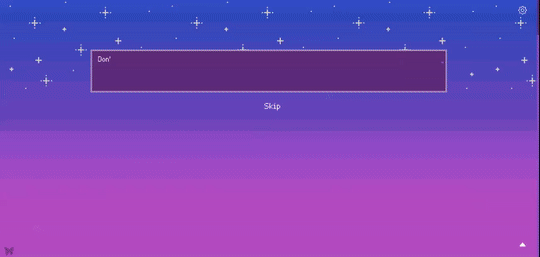
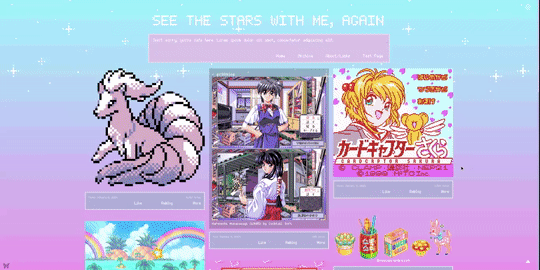
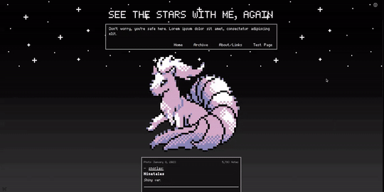
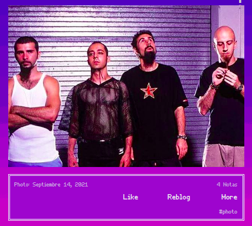
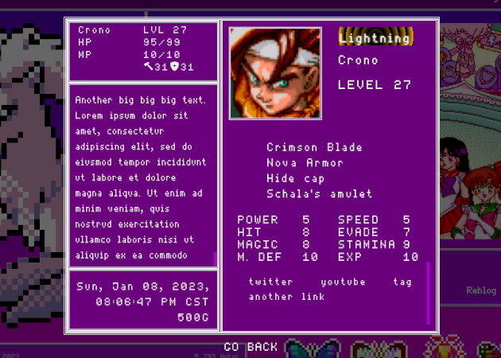
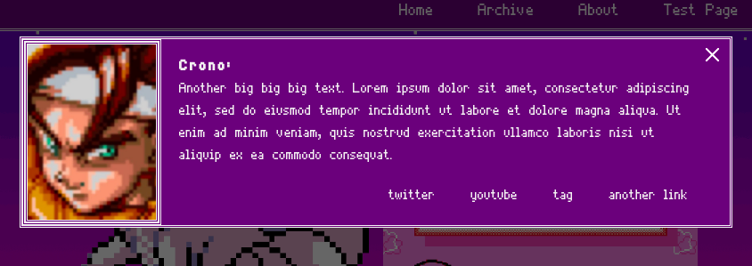
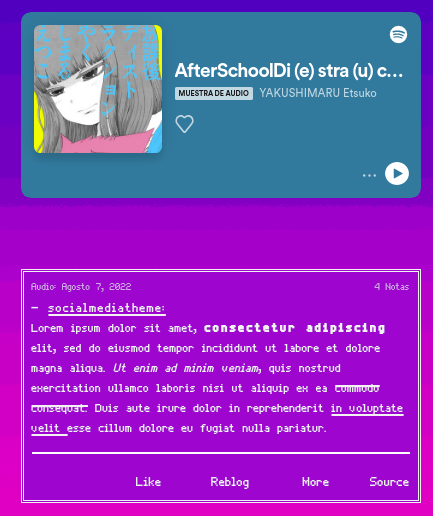
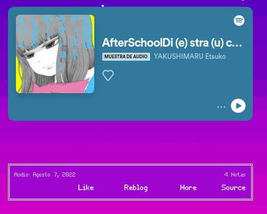
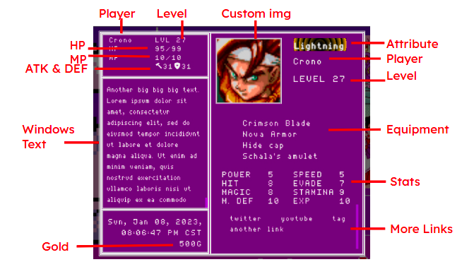

# See The Stars With Me, Again

A theme made for Tumblr blogs. Developed by Palemomos from [Themes By Pale (or Palemomos Themes)](https://themesbypale.tumblr.com/). 

## Install this theme

### Install via Theme Garden

1. To install the theme from the Tumblr's Theme Garden, go to [this link](https://www.tumblr.com/theme/41258) and click on **"Install"**. 

2. A dropdown will appear with a list of your main and side blogs. Select the blog you want to use the theme, and click **"Install"** again.

Note: It is recommended to use Theme Garden to install the theme, because when new changes/fixes are added, the theme will be updated automatically.

### Install with source code

1. To install the theme using the source code, go to [this link](https://gitlab.com/Palemona/tumblr-themes/-/raw/master/See_The_Stars_With_Me,_Again/seethestarswithmeagain.html), you'll be redirected to a page containing the source code.

2. Copy ALL the content of the page. Use <kbd>Ctrl</kbd> + <kbd>A</kbd> or <kbd>Command ⌘</kbd> + <kbd>A</kbd> to select all the text, and then copy it (<kbd>Ctrl</kbd> + <kbd>C</kbd> or <kbd>Command ⌘</kbd> + <kbd>C</kbd>).

3. Go to your blog and find the **Edit appereance** option. You'll be redirected you to the customization page.

4. Click on **Edit HTML**. Delete all the current content, and paste the code copied in step 2 <kbd>Ctrl</kbd> + <kbd>V</kbd> or <kbd>Command ⌘</kbd> + <kbd>V</kbd>.

5. Click **Update Preview** and then click **Save**.

--------

## Customization Guide

The theme comes with the following options in the customization panel.

### Images

- *Custom dialogue image* : Refers to the image displayed in the popup (if active).

<figure style="width: 400px;">
    
</figure>

### Mandatory options

- **Text size** : Refers to the size of the texts from posts, navigation, links and texts from the popup. The possible values are *Small*, *Medium* and *Big*. Since the theme has different text sizes through all sections, the sizes are calculated in proportion of one of these options.

- **Columns number** : Refers to how many columns will be used to distribute the posts on the home page. The possible values are *1*, *2* and *3*. Note that in permalink page and on mobile version the posts will be always rendered in one column. Also note the columns are going to distribute the posts like the following:

- **Color Mode** : Refers to which color scheme the theme will use. The possible values are *Retro*, *Pastel* and *Dark*. This option changes the background image and the color of the boxes.

    <figure style="width: 300px; text-align: center;">
        
        <figcaption>Retro</figcaption>
    </figure>
    <figure style="width: 300px; text-align: center;">
        
        <figcaption>Pastel</figcaption>
    </figure>
    <figure style="width: 300px; text-align: center;">
        
        <figcaption>Dark</figcaption>
    </figure>

### Conditionals

- **Fixed Navigation** : Refers if the navigation box (the dialogue box at the top of the page) is going to behave sticky when scrolling down the page or not. 

- **Show tags** : Refers if the tags (if the post has any) of a post will be rendered in the caption box.

 <figure style="width: 300px; text-align: center;">
    
    <figcaption>Tag rendered at the bottom of the post if enabled.</figcaption>
</figure>

- **Show PopUp** : Refers if the custom popup (Regular or Player Stats) will be visible on the theme. If active, the navigation will render a link to open it.

- **Enable Player Stats** : Refers if the custom popup will render a simple dialogue box or a more complex "player stats" style box. 

    <figure style="width: 400px; text-align: center;">
        
        <figcaption>Preview of the popup if this option is enabled.</figcaption>
    </figure>
    <figure style="width: 400px; text-align: center;">
        
        <figcaption>Preview of the popup if this option is NOT enabled.</figcaption>
    </figure>

- **Show ask** : Refers if the navigation box will render a link to redirect the user to the ask page.

- **Hide captions** : Refers if the caption of the posts will be hidden in the Home Page. Note that the caption will be always visible on Permalink Page. Also, captions from texts posts will not be hidden.

    <figure style="width: 300px; text-align: center;">
        
        <figcaption>Hide captions not enabled</figcaption>
    </figure>
    <figure style="width: 300px; text-align: center;">
        
        <figcaption>Hide captions enabled</figcaption>
    </figure>

- **Typing effect** : Refers if the theme will display a start animation before showing posts. The animation will only play on the first page of the Home Page. This option also enables an option to skip the animation.

<figure style="width: 500px; text-align: center;">
    
    <figcaption>Preview of the animation</figcaption>
</figure>

- **Show window image** : Refers if the image uploaded on **Custom dialogue image** will be visible or not.

### Input Texts

- **More tab** : Refers to the text that will be displayed in the link that opens the popup window.

- **Player** : Refers to the "name" of the "player" that will be shown on the popup.

- **More Links** : Refers to a list of links that will be rendered in the popup. To display the list correctly, needs to be written with the following format: *url,name,url,name,url,name*. It is important to write the items withouth spaces between commas. Example: 
>https://twitter.com/,twitter,https://www.youtube.com/,youtube,https://seethestarswithmeagaintheme.tumblr.com/tagged/tags,tag,pasteanotherlink,another link

- **Windows Text** : Refers to the text that will be displayed in the popup. It can have any length. The following image displays where the text will be redered depending if the switch "Enable Player Stats" is active or not.

The following options are exclusive of the **Enable Player Stats** option, if this option is not enabled is not necesary to fill these options.

<figure style="width: 500px; text-align: center;">
    
    <figcaption>How data is displayed in PopUp</figcaption>
</figure>

- **Attribute** : Refers to the "attribute" of the "player". Any input the user enters will be valid, but the following values add a certain style to the text: *fire*, *shadow*, *water*, *lightning*. It is important to write these inputs all in lowercase.

- **Level** : Refers to the "level" of the "player". Any input will be valid, but is recommended to enter a number to maximum 5 digits.

- **HP** : Refers to the "health points" of the "player". Any input will be valid, but the ideal is to enter it with the following format: *number*/*number*. Example: 
>52/100

- **MP** : Refers to the "magic points" of the "player". Any input will be valid, but the ideal is to enter it with the following format: *number*/*number*. Example: 
>70/90

- **Gold** : Refers to the total quantity of "gold" (money) of the "player". Any input will be valid, but the ideal is to enter a number.

- **Equipment** : Refers to the "equipment" of the "player". This will render a list of items that the player has equiped. To display the list correctly, needs to be written with the following format: *item, item, item, item* . It is important to write a comma between each item. This list can have any quantity of items, but it is recommend to add a maximum of 4 items. Example: 
>Crimson Blade, Nova Armor, Hide cap, Schala's amulet 

- **Stats** : Refers to the actual "stats" of the "player". This will render a list of the stats of the player. To display the list correctly, needs to be written with the following format: *attribute:number, attribute:number, attribute:number, attribute:number* . It is important to write a comma between each item and separate an attribute from its value with two points. This list can have any quantity of items, but it is recommend to add a maximum of 10 items. When more of 4 items are rendered, the list will be displayed in 2 columns. Example: 
>POWER:5, HIT:8, MAGIC:8, M. DEF:10, SPEED:5, EVADE:7, STAMINA:9, EXP:10

--------
## Other notes

- The values shown for ATK/DEF in the PopUp will be the sum of all the values from the stats.
- To add a custom link to the navigation menu, just add a page to your theme and select the option "Link".

<figure>
    
</fiture>

--------
## Terms of Use

- You can't remove credits (visible credits or in code credits).
- You can't copy portions of the code into any other works.
- You can't redistribute these works on other blogs or websites.
- You can't use the themes outside Tumblr or try to replicate them in other platform.
- You can use pages in other websites.
- You can customize anything (of the code) as you want.